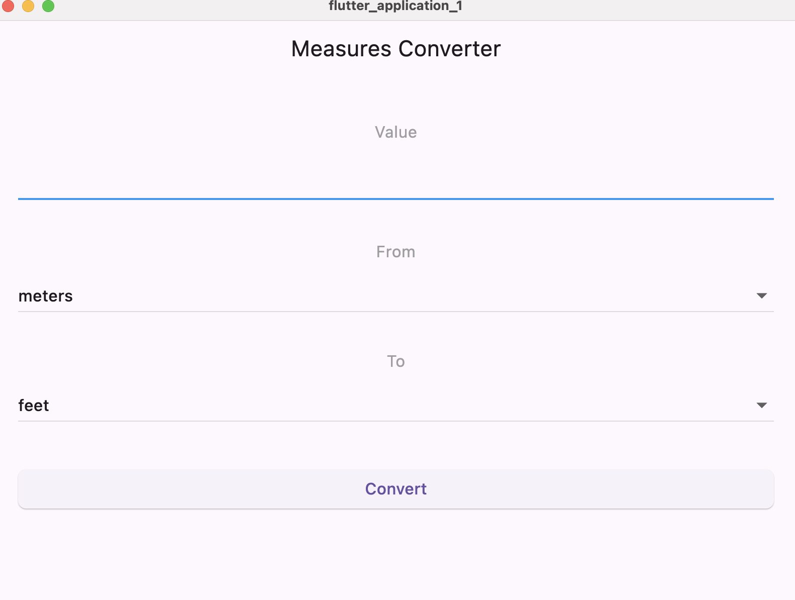

# Measures Converter App

A simple and intuitive Flutter application for converting between different units of measurement.

## Features

- **Length Conversions**: meters, feet, kilometers, miles, inches, yards
- **Weight Conversions**: kilograms, pounds, ounces, grams
- **Temperature Conversions**: Celsius, Fahrenheit, Kelvin
- Clean, user-friendly interface
- Instant conversion results
- Cross-platform support (iOS & Android)

## Requirements

- Flutter SDK 3.0 or higher
- Dart SDK 2.17 or higher
- Android Studio / VS Code with Flutter plugins
- For iOS: Xcode (macOS only)

## Installation

1. Clone the repository:
```bash
git clone https://github.com/Rumba19/MSCS_533_Flutter_app
cd MSCS_533_Flutter_app
```

2. Install dependencies:
```bash
flutter pub get
```

3. Run the app:
```bash
flutter run
```

## Usage

1. Enter a numeric value in the input field
2. Select the unit you're converting FROM using the first dropdown
3. Select the unit you're converting TO using the second dropdown
4. Tap the "Convert" button
5. View your conversion result below the button

## Project Structure

```
lib/
  └── main.dart          # Main application code
android/                 # Android-specific files
ios/                     # iOS-specific files
```

## How It Works

The app uses a conversion rate table for length and weight conversions, performing simple multiplication to calculate results. Temperature conversions use specialized formulas, converting through Celsius as an intermediate step to ensure accuracy.
 
 ## Output
 
